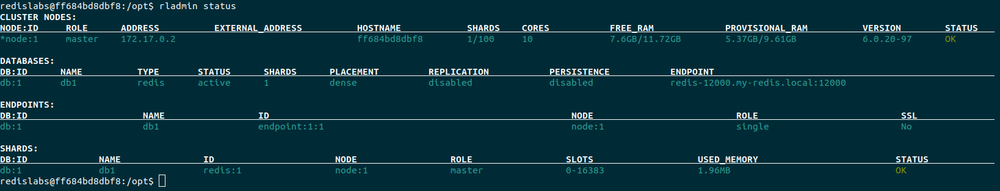

# Key-Value-Stores
This repository contains the exercises for the lecture **Key Value Stores**, which took place in the course **Storage Systems** in the summer term 2021.

# 1. System Configuration
During the course of the exercise, we will run multiple Redis nodes using Docker. All the following steps can be performed **directly on your machine**. However, if you don't want to do a Docker installation directly on your machine, you can also switch to a **VM**. Note, that for smooth functionality from the Redis cluster, at least 
- 2 CPU cores and 
- 6GB of memory are required.

*We recommend the installation on Ubuntu, as we can provide an installation script (tested on 20.04 LTS) for this.*

For installation on other operating systems or Linux distributions we can refer to the official sources:

[Installation on Windows](https://docs.docker.com/docker-for-windows/install/)

[Installation on Mac](https://docs.docker.com/docker-for-mac/install/)

[Installation on Linux](https://docs.docker.com/engine/install/)

---

## 1.1 Get a Virtual Machine Running
...

---

## 1.2 Installing Docker on Ubuntu
 You can use the provided [installation script](https://github.com/mikeptrsn/key-value-stores/blob/main/docker_install.sh) for this on Ubuntu (tested on 20.04 LTS).

Check if docker is running first with `sudo systemctl status docker` and then with `docker run hello-world`. The first command checks if the daemon is working properly. The second command is to check if the permissions for the current user are set correctly. If there is an error regarding the permissions for running `docker run`, check again the commands in the [installation script](https://github.com/mikeptrsn/key-value-stores/blob/main/docker_install.sh) starting at line 30 (post-installation steps).

# 2. Hello World: Your First Redis Node
In this Hello World example, you'll set up a simple single node cluster in Redis.

:watch: *Time to complete:* ~10 minutes
## 2.1 Load the Redis Image
Redislabs provides a prebuilt [image](https://registry.hub.docker.com/r/redislabs/redis) for Docker, which can be deployed with the following command:
```
docker run -d --cap-add sys_resource \
--name  redis-node1 \
-p 8443:8443 \
-p 9443:9443 \
-p 12000:12000 \
redislabs/redis
```

| Parameter | Description |
| --------: | :---------- |
| `-d`      | run in background|
|`--cap-add sys_resource`| add Linux sys_resources capabilities to proper privileges |
| `--name redis-node1`| container name |
| `-p 8443:8443` | port number for management UI (HTTPS)|
| `-p 9443:9443` | port number for REST API (HTTPS) |
| `-p 12000:12000` | TCP port used as database endpoint on this node |
| `redislabs/redis` | RedisLabs image (enterprise version of redis) |

---

## 2.2 Create a new Cluster
Now configure a Redis cluster using the `rladmin` tool and `create cluster command`:

```
docker exec -d --privileged \
redis-node1 "/opt/redislabs/bin/rladmin" \
cluster create \
name my-redis.local \
username myname@mymail.com \
password storage21
```
---

## 2.3 Adding a Database
Then create a new database on the cluster as follows:
```
curl -k -u "myname@mymail.com:storage21" \
--request POST \
--url "https://localhost:9443/v1/bdbs" \
--header 'content-type: application/json' \
--data '{"name":"db1","type":"redis","memory_size":128000000,"port":12000}'
``` 
---

## 2.4 Checking That Redis is Working

Congratulations! :tada: You have
- installed a single node cluster or Redis Enterprise using Docker,
- created a new cluster and
- created a new database (listening on port 12000).

Go ahead and try out Redis by connecting to the container and SET a key-value-pair by using the `redis-cli`:

```
docker exec -it redis-node1 /bin/bash

redislabs@[container-id]:/opt$ redis-cli-p 12000

127.0.0.1:12000> SET foo bar
OK

127.0.0.1:12000> GET foo
"bar"

127.0.0.1:12000> exit
```

Stay in the container for a moment and get an overview by running the command `rladmin status`, to get information about the deployment.



As you can probably see in this overview, we have not yet made any special settings regarding clustering and replication. In the next step, we will add new nodes to the cluster and enable replication and sharding.

---

# 3. Extend your Cluster
Now it is time to add new nodes and perform a cluster join. You will also enable clustering and replication for the database.

:watch: *Time to complete:* ~20 minutes

## 3.1 Adding New Nodes

To add new nodes to the cluster, you need to start new containers. For this you can use the command from section [2.1](./README.md#2.1-Load-the-Redis-Image) Please note that all nodes run on the same host. This means that you have to assign different values for the different endpoint ports. 

Example: `-p 8443:8443` is already taken by redis-node1. Try something like `-p 8444:8443` etc.


## Sources

[Docker Installation](https://www.digitalocean.com/community/tutorials/how-to-install-and-use-docker-on-ubuntu-20-04)

[Redis Installation and Configuration](http://tgrall.github.io/blog/2019/09/05/multi-nodes-redis-cluster-with-docker/)