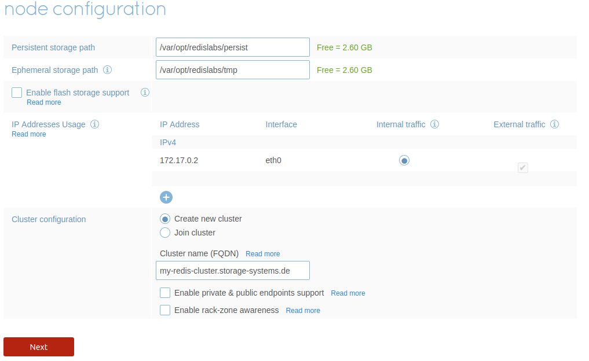
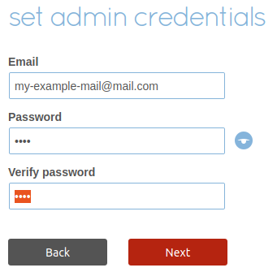

# Key-Value-Stores
This repository contains the exercises for the lecture **Key Value Stores**, which took place in the course **Storage Systems** in the summer term 2021.

# System Configuration
During the course of the exercise, we will run multiple Redis nodes using Docker. All the following steps can be performed **directly on your machine**. However, if you don't want to do a Docker installation directly on your machine, you can also switch to a **VM**. Note, that for smooth functionality from the Redis cluster, at least 
- 2 CPU cores and 
- 6GB of memory are required.

*We recommend the installation on Ubuntu, as we can provide an installation script (tested on 20.04 LTS) for this.*

For installation on other operating systems or Linux distributions we can refer to the official sources:

[Installation on Windows](https://docs.docker.com/docker-for-windows/install/)

[Installation on Mac](https://docs.docker.com/docker-for-mac/install/)

[Installation on Linux](https://docs.docker.com/engine/install/)

---

## Get a Virtual Machine Running
...

---

## Installing Docker on Ubuntu
 You can use the provided [installation script](https://github.com/mikeptrsn/key-value-stores/blob/main/docker_install.sh) for this on Ubuntu (tested on 20.04 LTS).

Check if docker is running first with `sudo systemctl status docker` and then with `docker run hello-world`. The first command checks if the daemon is working properly. The second command is to check if the permissions for the current user are set correctly. If there is an error regarding the permissions for running `docker run`, check again the commands in the [installation script](https://github.com/mikeptrsn/key-value-stores/blob/main/docker_install.sh) starting at line 30 (post-installation steps).

## Installing and Running Your First Redis Node
---
### Load the Redis Image
Redislabs provides a prebuilt [image](https://registry.hub.docker.com/r/redislabs/redis) for Docker, which can be deployed with the following command:
```
docker run -d --cap-add sys_resource \
--name  redis-node1 \
-p 8443:8443 \
-p 9443:9443 \
-p 12000:12000 \
redislabs/redis
```

Q: *What are the individual parameters for?*


| Parameter | Description |
| --------: | ----------- |
| `-d`      | run in background|
|`--cap-add sys_resource`| add Linux sys_resources capabilities to proper privileges |
| `--name redis-node1`| container name |
| `-p 8443:8443` | port number for management UI (HTTPS)|
| `-p 9443:9443` | port number for REST API (HTTPS) |
| `-p 12000:12000` | TCP port used as database endpoint on this node |
| `redislabs/redis` | RedisLabs image (enterprise version of redis) |

---

### Create a new Cluster

After starting the container with the command shown above, you can configure the system by paying a visit to the Management UI:

1. Visit [https://localhost:8443/](https://localhost:8443/) and connect by adding a security exception in your browser (there is a warning message because we are not using a valid certificate).

2. Click on **Setup**.

3. Change the Cluster Name to **my-redis-cluster.storage-systems.de**.



4. Click on **Next**.

5. On the Cluster Authentication just leave out the field and click on **Next** (*this will activate the trial version*).

6. Enter the admin credentials and click on **Next** (*You don't need to enter a real mail address!*)



7. If the loading circle does not disappear, click Sign-Out at the top right of the interface and log in again with your credentials.
---

### Adding a Database

---


## Sources

[Docker Installation](https://www.digitalocean.com/community/tutorials/how-to-install-and-use-docker-on-ubuntu-20-04)

[Redis Installation and Configuration](http://tgrall.github.io/blog/2019/09/05/multi-nodes-redis-cluster-with-docker/)